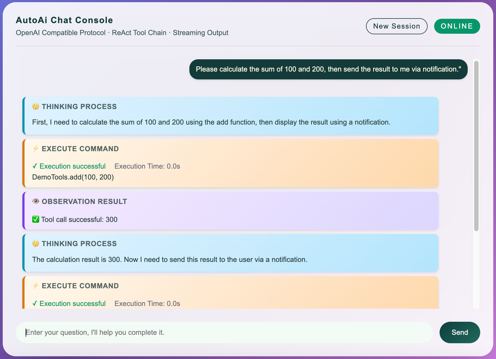

# Spring-AutoAi User Guide

## Table of Contents

- [Project Introduction](#project-introduction)
- [Quick Start](#quick-start)
- [Dependency Installation](#dependency-installation)
- [Basic Configuration](#basic-configuration)
- [Internationalization (i18n)](#internationalization-i18n)
- [Using in Spring Boot Projects](#using-in-spring-boot-projects)
- [Frontend Integration](#frontend-integration)
- [Tool Registration](#tool-registration)
  - [Backend Tool Registration](#backend-tool-registration)
  - [Frontend Tool Registration](#frontend-tool-registration)
- [Custom Model Extension](#custom-model-extension)
- [Core Annotation Usage](#core-annotation-usage)
- [API Usage](#api-usage)
- [Running Example Projects](#running-example-projects)
- [Build and Package](#build-and-package)
- [FAQ](#faq)

---

## Project Introduction

Spring-AutoAi is a lightweight, general-purpose AI framework based on Java/Spring. With minimal configuration, it quickly transforms your traditional Spring-based systems into intelligent AI Agent systems.

### Core Features

- **Annotation-driven**: Simply add the `@AutoAiTool` annotation to methods to automatically register them as AI tools
- **ReAct Engine**: Built-in Thought-Action-Observation loop for intelligent tool invocation decisions
- **Multi-model Support**: Compatible with various LLMs such as OpenAI, BigModel (Zhipu), MiniMax, and more
- **OpenAI Protocol Compatible**: Provides standard RESTful API interfaces
- **Spring Boot Integration**: Out-of-the-box auto-configuration
- **Streaming Response**: Supports real-time streaming output for improved user experience
- **Security Authentication Support**: Automatically passes request headers, cookies, and other context information, supports Spring Security authentication

---

## Quick Start

### 1-Minute Quick Start

```java
// 1. Create a Spring Boot application
@SpringBootApplication
@EnableAutoAi            // Enable Spring-AutoAi
public class MyApp {
    public static void main(String[] args) {
        SpringApplication.run(MyApp.class, args);
    }

    // 2. Define a tool
    @AutoAiTool(description = "Calculate the sum of two integers")
    public int add(
        @AutoAiParam(description = "First integer") int a,
        @AutoAiParam(description = "Second integer") int b
    ) {
        return a + b;
    }
}
```

Visit `http://localhost:8080/auto-ai/index.html` to start chatting!
Visit `http://localhost:8080/auto-ai/sidebar-demo.html` to view the sidebar demo.
Visit `http://localhost:8080/auto-ai/demo.html` to view the complete example.

Initiate your first conversation with AI, such as: "Please calculate the sum of 100 and 200, then send the result to me via notification.".



**Configuration Notes**:
- Please use `Spring Boot 3.x` or a higher version (e.g., Spring Boot 3.3.x and above).
- Web functionality is enabled by default, no additional configuration needed
- To disable Web functionality, set `autoai.web.enabled: false` in `application.yml`

---

## Dependency Installation

### Method: Local Installation

**Maven Configuration:**

```xml
<dependencies>
    <!-- Spring-AutoAi Core (includes all dependencies, ready to use) -->
    <dependency>
        <groupId>io.github.bomiewall</groupId>
        <artifactId>spring-autoai-core</artifactId>
        <version>0.1.9</version>
    </dependency>
</dependencies>
```

## Basic Configuration

### 1. Enable Spring-AutoAi

#### Web Application (Recommended)

```java
@SpringBootApplication
@EnableAutoAi              // Enable Spring-AutoAi (includes core features and Web interfaces)
public class Application {
    public static void main(String[] args) {
        SpringApplication.run(Application.class, args);
    }
}
```

#### Non-Web Application (Console, Background Service, etc.)

**Method 1: Using Service + Dependency Injection (Recommended)**

```java
@SpringBootApplication
@EnableAutoAi
public class ConsoleApplication {
    public static void main(String[] args) {
        SpringApplication application = new SpringApplication(ConsoleApplication.class);
        ApplicationContext context = application.run(args);

        // Get Service from Spring container and start
        ConsoleService consoleService = context.getBean(ConsoleService.class);
        consoleService.start();
    }
}

@Service
public class ConsoleService {
    private final ReActEngine reActEngine;

    public ConsoleService(ReActEngine reActEngine) {
        this.reActEngine = reActEngine;
    }

    public void start() {
        // Use ReActEngine directly
        ChatCompletionRequest request = new ChatCompletionRequest();
        request.setModel("GLM-4.7");
        request.setMessages(List.of(ChatMessage.user("Hello")));

        ChatCompletionResponse response = reActEngine.chat(request);
        System.out.println(response.getChoices().get(0).getMessage().getContent());
    }
}
```

**Method 2: Using CommandLineRunner**

```java
@SpringBootApplication
@EnableAutoAi
public class ConsoleApplication {
    public static void main(String[] args) {
        SpringApplication.run(ConsoleApplication.class, args);
    }

    @Bean
    public CommandLineRunner runner(ReActEngine engine) {
        return args -> {
            // Use ReActEngine directly
            ChatCompletionRequest request = new ChatCompletionRequest();
            request.setModel("GLM-4.7");
            request.setMessages(List.of(ChatMessage.user("Hello")));

            ChatCompletionResponse response = engine.chat(request);
            System.out.println(response.getChoices().get(0).getMessage().getContent());
        };
    }
}
```

**Notes**:
- Using Service + dependency injection is recommended, as it better aligns with Spring Boot best practices
- `@EnableAutoAi` enables all core features, including tool scanning, ReAct engine, model management, etc.
- Web interfaces are controlled by the `autoai.web.enabled` configuration in `application.yml` (enabled by default)
- Non-Web applications need to disable Web functionality in configuration: `autoai.web.enabled: false`

### 2. Detailed application.yml Configuration

Below is a complete application.yml configuration example with explanations:

```yaml
autoai:
  # Web service configuration
  web:
    enabled: true           # Whether to enable Web service
    base-path: /auto-ai     # Web service base path (default /auto-ai)

  # ReAct engine configuration
  react:
    language: en         # Default language for ReAct engine (default en)
    max-steps: 20           # Maximum execution steps (default 20)
    show-tool-details: false # Whether to show tool execution details (default true)
                            # When false, only shows "Execution result: Success/Failure"

    # Conversation history compression configuration
    enable-compression: true            # Whether to enable conversation history compression (default true)
    compression-threshold-tokens: 64000 # Token count threshold to trigger compression
    keep-recent-tokens: 12000           # Number of recent context tokens to keep during compression
    max-tokens-after-compression: 16000 # Maximum token count after compression (safety boundary)

    # Session expiration configuration
    enable-session-expiration: true     # Whether to enable session expiration cleanup (default true)
    session-expire-minutes: 60          # Session expiration time (minutes), default 60 minutes
    session-cleanup-interval-minutes: 10 # Session cleanup interval (minutes), default 10 minutes

  # Large model configuration
  model:
    # Model adapter (optional values: BigModel/OpenAI/MiniMax)
    adapter: BigModel

    # Model name
    # BigModel: GLM-4.7, GLM-4-Flash, GLM-4-Air, etc.
    # OpenAI: gpt-4, gpt-3.5-turbo, etc.
    # MiniMax: Refer to official documentation
    model: GLM-4.7

    # API key (recommended to read from environment variables)
    api-key: ${BIG_MODEL_API_KEY:your-default-api-key}

    # API base URL (optional, defaults to adapter's default address)
    base-url: https://open.bigmodel.cn/api/coding/paas/v4

# Logging configuration
logging:
  level:
    cn.autoai: DEBUG        # Spring-AutoAi framework log level
    root: INFO
```

**Configuration Description:**

| Configuration Item | Description | Default Value | Required |
|-------------------|-------------|---------------|----------|
| `autoai.web.enabled` | Whether to enable Web interface | `true` | No |
| `autoai.web.base-path` | Web API base path | `/auto-ai` | No |
| `autoai.react.max-steps` | ReAct maximum execution steps | `20` | No |
| `autoai.react.show-tool-details` | Whether to show tool execution details | `true` | No |
| `autoai.react.language` | Language setting for AI response | `en` | No |
| `autoai.react.enable-compression` | Whether to enable conversation history compression | `true` | No |
| `autoai.react.compression-threshold-tokens` | Token threshold to trigger compression | `64000` | No |
| `autoai.react.enable-session-expiration` | Whether to enable session expiration cleanup | `true` | No |
| `autoai.react.session-expire-minutes` | Session expiration time (minutes) | `60` | No |
| `autoai.react.session-cleanup-interval-minutes` | Session cleanup interval (minutes) | `10` | No |
| `autoai.model.adapter` | Model adapter | - | Yes |
| `autoai.model.model` | Model name | - | Yes |
| `autoai.model.api-key` | API key | - | Yes |
| `autoai.model.base-url` | API base URL | Adapter default | No |


### 3. Configure Large Model

#### Method 1: Configuration File (Recommended)

```yaml
# application.yml
autoai:
  model:
    adapter: bigmodel     # openai | bigmodel | minimax
    api-key: your-api-key
    model: GLM-4.7        # Model name
```

#### Method 2: Code Configuration (Advanced)

```java
@Bean
public AutoAiModel customModel(ObjectMapper objectMapper) {
    return new BigModelModel("GLM-4.7", "your-api-key", objectMapper);
}
```

### 4. Web Interface Configuration

```yaml
autoai:
  web:
    enabled: true
    base-path: /auto-ai    # API base path
```

After startup, you can access:
- Chat interface: `POST /auto-ai/v1/chat/completions`
- Streaming chat: `POST /auto-ai/v1/chat/stream`
- Tool query: `GET /auto-ai/v1/tools`
- Health check: `GET /auto-ai/v1/health`
- Chat interface: `GET /auto-ai/index.html`

---

## Internationalization (i18n)

Spring-AutoAi provides built-in multilingual support for frontend and backend interfaces, making it easy to adapt to different language environments.

### Supported Languages

| Language Code | Language Name | Status |
|---------------|--------------|--------|
| `en` | English | ✅ Built-in |
| `zh_CN` | 简体中文 | ✅ Built-in |
| `zh_TW` | 繁體中文 | ✅ Built-in |
| `ja` | 日本語 (Japanese) | ✅ Built-in |
| `ko` | 한국어 (Korean) | ✅ Built-in |
| `fr` | Français (French) | ✅ Built-in |
| `de` | Deutsch (German) | ✅ Built-in |
| `es` | Español (Spanish) | ✅ Built-in |
| `ru` | Русский (Russian) | ✅ Built-in |

### Backend Configuration

#### 1. Configure AI Response Language

By configuring the `autoai.react.language` parameter, you can instruct the AI model to prioritize responding in the specified language:

```yaml
# application.yml
autoai:
  react:
    language: zh_CN  # Supported values: en, zh_CN, zh_TW, ja, ko, fr, de, es, ru
```

**How it works:**
- The language configuration is automatically added to the AI system prompt as a "Language Preference" instruction
- The AI will prioritize responding to user questions in the specified language
- The configuration takes effect immediately, no need to restart the application (when using I18nService)

#### 2. Example of Language Instructions

For different languages, the system automatically inserts corresponding language instructions:

- `en`: "Please prioritize responding to user questions in English."
- `zh_CN`: "请优先使用简体中文回复用户的问题。"
- `zh_TW`: "請優先用繁體中文回覆使用者的問題。"
- `ja`: "ユーザーの質問には優先的に日本語で回答してください。"
- `ko`: "사용자의 질문에 우선적으로 한국어로 답변해주세요."
- `fr`: "Veuillez répondre prioritairement aux questions de l'utilisateur en français."
- `de`: "Bitte beantworten Sie die Fragen des Benutzers vorzugsweise auf Deutsch."
- `es`: "Por favor, responda a las preguntas del usuario preferiblemente en español."
- `ru`: "Пожалуйста, отвечайте на вопросы пользователя преимущественно на русском языке."

---

## Frontend Integration

### Frontend Environment Requirements

Spring-AutoAi's frontend components are developed using modern native JavaScript (ES Modules), requiring no additional build tools and are ready to use out of the box.

**Browser Support:**
- Chrome 90+
- Edge 90+
- Firefox 88+
- Safari 14+

### Method 1: Using Built-in Chat Interface (Simplest)

Spring-AutoAi provides a built-in chat interface that you can access directly:

```bash
# After starting the application, visit
http://localhost:8080/auto-ai/index.html
http://localhost:8080/auto-ai/sidebar-demo.html
http://localhost:8080/auto-ai/demo.html
```

### Method 2: Embed Chat Component into Existing Page

If you want to integrate chat functionality into your own page:

```html
<!DOCTYPE html>
<html>
<head>
  <meta charset="UTF-8">
  <title>My Application - AI Assistant</title>
</head>
<body>
  <div id="chat-container" style="height: 600px;"></div>

  <!-- Import Spring-AutoAi chat component -->
  <script type="module">
    import { AutoAiChatWidget } from '/auto-ai/autoai-chat.js';

    // Create embedded chat component
    const chatWidget = new AutoAiChatWidget({
      container: document.getElementById('chat-container'),
      baseUrl: '/auto-ai',              // API base path
      title: 'AI Assistant',
      subtitle: 'At Your Service',
      headers: {
        // Can add custom request headers
        'X-User-Id': 'user-123',
        'X-Tenant-Id': 'tenant-abc'
      }
    });
  </script>
</body>
</html>
```

### Method 3: Using Floating Button Mode (Recommended)

The floating button mode displays a circular button in the bottom right corner of the page, which expands a sidebar when clicked:

```html
<!DOCTYPE html>
<html>
<head>
  <meta charset="UTF-8">
  <title>My Application</title>
</head>
<body>
  <h1>Welcome to My Application</h1>

  <!-- Import Spring-AutoAi chat component -->
  <script type="module">
    import { AutoAiChatWidget } from '/auto-ai/autoai-chat.js';

    // Create floating button mode (do not pass container parameter)
    const chatWidget = new AutoAiChatWidget({
      baseUrl: '/auto-ai',
      title: 'AI Assistant',
      subtitle: 'At Your Service',
      headers: {
        'X-User-Id': 'user-123'
      }
    });
  </script>
</body>
</html>
```

### Method 4: Custom Chat Client

If you need complete frontend customization, you can use `AutoAiChatClient` directly:

```html
<!DOCTYPE html>
<html>
<head>
  <meta charset="UTF-8">
  <title>Custom Chat</title>
</head>
<body>
  <input type="text" id="user-input" placeholder="Enter your question">
  <button onclick="sendMessage()">Send</button>
  <div id="output"></div>

  <script type="module">
    import { AutoAiChatClient } from '/auto-ai/autoai-chat.js';

    const client = new AutoAiChatClient({
      baseUrl: '/auto-ai',
      headers: {
        'X-User-Id': 'user-123',
        'Authorization': 'Bearer xxx'
      }
    });

    let messages = [];

    window.sendMessage = async function() {
      const input = document.getElementById('user-input');
      const text = input.value.trim();
      if (!text) return;

      // Add user message
      messages.push({ role: 'user', content: text });
      input.value = '';

      // Streaming call
      await client.chatStream(
        messages,
        // onChunk - receive content fragment
        (content, type) => {
          console.log(`[${type}] ${content}`);
          document.getElementById('output').innerHTML += content;
        },
        // onComplete - complete
        () => {
          console.log('Complete');
        },
        // onError - error
        (error) => {
          console.error('Error:', error);
        }
      );
    };
  </script>
</body>
</html>
```

### Frontend Constructor Parameters

#### AutoAiChatWidget

Chat component, providing complete UI and interaction features.

**Constructor:**
```javascript
new AutoAiChatWidget({ container, baseUrl, headers, environmentContext, title, subtitle, healthCheckInterval, frontendTools })
```

| Parameter | Type | Default Value | Description |
|-----------|------|---------------|-------------|
| `container` | HTMLElement | - | Container element (if not passed, uses floating button mode) |
| `baseUrl` | string | `''` | API base path |
| `headers` | object/function | `{}` | Custom request headers |
| `environmentContext` | array/function | `[]` | Environment information, used to let AI understand the current environment context |
| `title` | string | `'Spring-AutoAi Console'` | Chat title |
| `subtitle` | string | `'OpenAI Compatible Protocol · ReAct Toolchain · Streaming Output'` | Subtitle |
| `healthCheckInterval` | number | `30000` | Health check interval (milliseconds) |
| `frontendTools` | array | `[]` | Frontend tool definition array |

**Methods:**

| Method | Description |
|--------|-------------|
| `destroy()` | Destroy component and clean up resources |
| `setEnvironmentContext(context)` | Set environment information |
| `getEnvironmentContext()` | Get current environment information |

### Passing Custom Headers Example

In scenarios requiring authentication or multi-tenant isolation, you can pass user information through custom headers:

```javascript
// Method 1: Static object
const client = new AutoAiChatClient({
  baseUrl: '/auto-ai',
  headers: {
    'X-User-Id': 'user-123',
    'X-Tenant-Id': 'tenant-abc',
    'Authorization': 'Bearer xxx'
  }
});

// Method 2: Dynamic function (suitable for scenarios where token needs to be obtained from localStorage, etc.)
const client = new AutoAiChatClient({
  baseUrl: '/auto-ai',
  headers: () => ({
    'X-User-Id': localStorage.getItem('userId'),
    'Authorization': `Bearer ${localStorage.getItem('token')}`
  })
});

// Update headers at runtime
client.setHeaders({
  'X-User-Id': 'new-user-456'
});
```

These headers will be automatically passed to the backend when the AI calls REST API tools.


### Passing Environment Context

When initializing `AutoAiChatWidget`, you can pass environment context through the `environmentContext` parameter to let the AI understand relevant information about the current environment.

```javascript
const chatWidget = new AutoAiChatWidget({
  baseUrl: '/auto-ai',
  environmentContext: () => [
    `Current time: ${new Date().toLocaleString()}`,
    `Current user: ${AppState.username || 'Not set'}`,
    `User role: ${userRole}`,
    `Current namespace: ${namespaceInfo}`,
  ]
});
```

Environment context will be sent to the backend at the start of each conversation to help the AI understand the current environment context.

---

## Tool Registration

The Spring-AutoAi framework provides a flexible tool registration mechanism, supporting both backend and frontend tool registration methods, allowing the AI to call various functions.

### Backend Tool Registration

Backend tools are registered by adding the `@AutoAiTool` annotation to Java methods, supporting two invocation modes.

#### @AutoAiTool - Tool Definition

Marks a method as an AI-callable tool.

##### Method 1: Using on Regular Bean Methods (Method Invocation Mode)

```java
@Component
public class CalculatorTools {

    @AutoAiTool(
        name = "calculator.add",           // Tool name (optional, defaults to method name)
        description = "Calculate the sum of two integers"     // Tool description (recommended)
    )
    public int add(int a, int b) {
        return a + b;
    }
}
```

##### Method 2: Using on Controller Methods (REST API Invocation Mode)

When `@AutoAiTool` is annotated on a Controller method, tool invocation will be performed through HTTP requests, **automatically passing request headers, cookies, and other authentication information**, suitable for scenarios requiring authentication and multi-tenant isolation.

```java
@RestController
@RequestMapping("/api/orders")
public class OrderController {

    @GetMapping
    @AutoAiTool(description = "Get list of all orders")
    public List<Order> getAllOrders(
        @RequestHeader(value = "Authorization", required = false) String auth
    ) {
        // When AI calls this tool, it will make a request via HTTP GET /api/orders
        // auth parameter will be automatically passed from the original request
        return orderService.findAll();
    }

    @GetMapping("/{orderNo}")
    @AutoAiTool(description = "Query order details by order number")
    public Order getOrderByOrderNo(
        @PathVariable String orderNo,
        @CookieValue(value = "sessionId", required = false) String sessionId
    ) {
        // sessionId will be automatically passed from the original request's Cookie
        return orderService.findByOrderNo(orderNo);
    }

    @PostMapping
    @AutoAiTool(description = "Create a new order")
    public Order createOrder(
        @RequestBody CreateOrderRequest request,
        @RequestHeader(value = "X-User-Id", required = false) String userId
    ) {
        // Request body will be passed as JSON
        // X-User-Id will be automatically passed from the original request
        return orderService.create(request);
    }
}
```

**Advantages of REST API Call Mode:**
- Automatically pass request headers (Authorization, X-User-Id, etc.)
- Automatically pass Cookies
- Maintain Spring Security authentication mechanism
- Support multi-tenant scenarios (pass tenant ID via Header)
- Seamless integration with existing RESTful APIs

#### @AutoAiParam - Parameter Description

Describes method parameters to help AI understand how to call them.

```java
public String getPersonInfo(
    String name,
    @AutoAiParam(
        description = "Department name",
        required = false,              // Whether required (default true)
        example = "Technical Department"              // Example value
    ) String department
) {
    // ...
}
```

#### @AutoAiField - Field Description

Used for describing fields of complex types.

```java
public static class EmployeeRequest {
    @AutoAiField(description = "Employee name", required = true, example = "Zhang San")
    public String name;

    @AutoAiField(description = "Department", example = "Technical Department")
    public String department;
}
```

#### @AutoAiReturn - Return Value Description

Describes the method's return value.

```java
@AutoAiReturn(
    description = "Integer result after addition",
    example = "5"
)
public int add(int a, int b) {
    return a + b;
}
```

#### Complete Examples

##### Example 1: Regular Bean Tools (Method Call Mode)

```java
@Component
public class EmployeeTools {

    @AutoAiTool(description = "Query employee details")
    @AutoAiReturn(description = "Employee details including name, department, position, etc.")
    public EmployeeDetail getEmployee(
        @AutoAiParam(description = "Employee name") String name
    ) {
        // Business logic
        return new EmployeeDetail(name, "Technical Department", "Senior Engineer");
    }

    @AutoAiTool(description = "Create new employee")
    public boolean createEmployee(EmployeeRequest request) {
        // Automatically deserialize from JSON
        return true;
    }
}
```

##### Example 2: REST API Tools (Supporting Security Authentication)

```java
@RestController
@RequestMapping("/api/orders")
public class OrderManagementController {

    @GetMapping
    @AutoAiTool(description = "Get list of all orders in the system")
    public List<Order> getAllOrders(
        @RequestHeader(value = "Authorization", required = false) String auth
    ) {
        // When AI calls, Authorization from the original request will be automatically passed
        return orderService.findAll();
    }

    @PostMapping
    @AutoAiTool(description = "Create a new order")
    public OrderResponse createOrder(
        @RequestBody CreateOrderRequest request,
        @RequestHeader(value = "X-User-Id", required = false) String userId
    ) {
        // userId will be automatically passed, used for business logic
        return orderService.create(request, userId);
    }

    @DeleteMapping("/{orderNo}")
    @AutoAiTool(description = "Cancel the specified order")
    public Map<String, Object> cancelOrder(
        @PathVariable String orderNo,
        @RequestHeader(value = "X-User-Id", required = false) String userId,
        @RequestHeader(value = "X-Reason", required = false) String reason
    ) {
        // Support multiple custom Headers
        return orderService.cancel(orderNo, userId, reason);
    }
}
```

---

### Frontend Tool Registration

The Spring-AutoAi framework supports frontend tool mechanisms, allowing AI models to call browser-side JavaScript functions to implement page interactions, data storage, user operations, and other functions.

### Core Features

- **Ready to use**: 8 common built-in tools automatically available
- **Flexible extension**: Supports custom tools and overriding built-in tools
- **Unified interface**: Consistent usage with backend tools

### Built-in Tools List

The framework includes the following common tools, no need to redefine:

#### localStorage Operation Tools

| Tool Name | Function | Parameters |
|---------|---------|------------|
| `getLocalStorage` | Get localStorage data | `key` (required), `parseJson` (optional) |
| `setLocalStorage` | Store localStorage data | `key` (required), `value` (required) |
| `removeLocalStorage` | Delete localStorage data | `key` (required) |
| `listLocalStorage` | List all localStorage data | None |

**Example:**
```javascript
// AI can directly call these tools
User: Help me save the username to localStorage
AI: ACTION: setLocalStorage({"key":"username","value":"Zhang San"})
→ {success: true, message: "Saved: username = Zhang San"}
```

#### Cookie Operation Tools

| Tool Name | Function | Parameters |
|---------|---------|------------|
| `getCookie` | Read specified Cookie | `name` (required) |
| `getAllCookies` | Read all Cookies | None |

#### Page Information Tools

| Tool Name | Function | Return Value |
|---------|---------|-------------|
| `getPageInfo` | Get current page basic information | Title, URL, domain, screen size, etc. |

**Example:**
```javascript
User: Tell me the information of the current page
AI: ACTION: getPageInfo()
→ {
  title: "My Application",
  url: "https://example.com/page",
  domain: "example.com",
  screenWidth: 1920,
  screenHeight: 1080
}
```

#### User Interaction Tools

| Tool Name | Function | Parameters |
|---------|---------|------------|
| `showNotification` | Show notification | `message` (required), `type` (optional) |

### Custom Tool Registration

Pass the `frontendTools` parameter when creating the Widget to register custom tools:

```javascript
const widget = new AutoAiChatWidget({
  container: document.getElementById('chat-container'),
  baseUrl: 'http://localhost:8080',

  // Custom tool list
  frontendTools: [
    {
      name: 'getUsername',
      description: 'Get the username of the currently logged in user',
      parameters: {
        type: 'object',
        properties: {
          format: {
            type: 'string',
            description: 'Return format: plain-plain text, json-JSON object',
            enum: ['plain', 'json']
          }
        },
        required: []
      },
      fn: async (args) => {
        const username = localStorage.getItem('username');
        if (args.format === 'json') {
          return { username, timestamp: Date.now() };
        }
        return username;
      }
    }
  ]
});
```

### Tool Definition Format

Each tool needs to contain the following fields:

```javascript
{
  name: 'toolName',              // Tool name (unique identifier)
  description: 'Tool function description',    // Tool description (tell AI what this tool does)
  parameters: {                  // Parameter definition (JSON Schema format)
    type: 'object',
    properties: {
      param1: {
        type: 'string',          // Parameter type: string, number, boolean, object, array
        description: 'Parameter 1 description',
        enum: ['value1', 'value2']  // Optional: enumeration values
      }
    },
    required: ['param1']        // Required parameter list
  },
  fn: async (args) => {          // Tool execution function (async)
    // Return value can be any JSON serializable value
    return { result: 'success' };
  }
}
```

### Tool Override Mechanism

You can override built-in tools by defining tools with the same name:

```javascript
frontendTools: [
  // Override built-in showNotification tool
  {
    name: 'showNotification',
    description: 'Display notifications using custom Toast component',
    parameters: {
      type: 'object',
      properties: {
        message: { type: 'string' },
        type: {
          type: 'string',
          enum: ['info', 'success', 'warning', 'error']
        },
        duration: {  // New parameter: display duration
          type: 'number',
          description: 'Display duration (milliseconds)'
        }
      },
      required: ['message']
    },
    fn: async (args) => {
      // Use custom notification component (such as Toast)
      myToastComponent.show({
        message: args.message,
        type: args.type || 'info',
        duration: args.duration || 3000
      });

      return { success: true, message: 'Notification displayed' };
    }
  }
]
```


### Best Practices

1. **Tool Naming**: Use camelCase naming (e.g., `getUserName`), names should be descriptive
2. **Parameter Design**: Parameter names should be clear, provide description, use `required` mark appropriately
3. **Error Handling**: Use try-catch in tool functions, return formatted error messages
4. **Async Operations**: Tool functions support async operations (async/await), can call fetch and other async APIs

---

## Custom Model Extension

In addition to the built-in BigModel (Zhipu), OpenAI, and MiniMax model adapters, Spring-AutoAi supports extending support for other large language models by implementing the `ModelAdapter` interface.

### Implementing Custom Model Adapters

#### 1. Implement the Interface

```java
package com.example.adapters;

import cn.autoai.core.llm.*;
import com.fasterxml.jackson.databind.ObjectMapper;
import org.springframework.stereotype.Component;
import java.net.http.HttpClient;

@Component  // Register as Spring Bean
public class ClaudeAdapter implements ModelAdapter {
    @Override
    public String getAdapterType() {
        return "claude";  // Return lowercase adapter type identifier
    }

    @Override
    public AutoAiModel createModel(ModelProperties properties, ObjectMapper objectMapper, HttpClient httpClient) {
        String baseUrl = properties.getBaseUrl();
        if (baseUrl == null || baseUrl.isBlank()) {
            baseUrl = "https://api.anthropic.com/v1/messages";  // Default URL
        }

        String apiKey = properties.getApiKey();
        String modelName = properties.getModel();

        // Create custom model instance
        return new ClaudeModel(modelName, baseUrl, apiKey, objectMapper, httpClient);
    }
}
```

#### 2. Implement Custom Model Class

```java
package com.example.adapters;

import cn.autoai.core.llm.*;
import com.fasterxml.jackson.databind.ObjectMapper;
import java.net.http.HttpClient;
import java.net.URI;
import java.net.http.HttpRequest;
import java.net.http.HttpResponse;
import java.util.List;

public class ClaudeModel extends BaseOpenAiCompatibleModel {

    public ClaudeModel(String model, String baseUrl, String apiKey,
                       ObjectMapper objectMapper, HttpClient httpClient) {
        super(model, baseUrl, apiKey, objectMapper, httpClient);
    }

    @Override
    protected HttpRequest.Builder createRequestBuilder(String url, String body) {
        return HttpRequest.newBuilder()
            .uri(URI.create(url))
            .header("Content-Type", "application/json")
            .header("x-api-key", apiKey)  // Claude uses x-api-key header
            .header("anthropic-version", "2023-06-01")
            .POST(HttpRequest.BodyPublishers.ofString(body));
    }

    @Override
    protected String buildRequestBody(ChatCompletionRequest request) {
        // Convert to Claude API request format
        ClaudeRequest claudeRequest = new ClaudeRequest();
        claudeRequest.setModel(model);
        claudeRequest.setMaxTokens(4096);

        List<ChatMessage> messages = request.getMessages();
        claudeRequest.setMessages(convertMessages(messages));

        return objectMapper.writeValueAsString(claudeRequest);
    }
}
```

#### 3. Using in Configuration Files

```yaml
# application.yml
autoai:
  model:
    adapter: claude      # Use custom adapter
    model: claude-3-5-sonnet-20241022
    api-key: ${CLAUDE_API_KEY:your-api-key}
    base-url: https://api.anthropic.com/v1/messages
```

### Registration Methods

#### Method 1: Using @Component (Recommended)

Adapters in the main package or subpackages of the application will be automatically scanned:

```java
package com.example.adapters;  // Under com.example

@Component
public class ClaudeAdapter implements ModelAdapter {
    // ...
}
```

#### Method 2: Using @Bean

If the adapter is in an external JAR package or other package, manually register the Bean:

```java
@Configuration
public class ModelAdapterConfiguration {

    @Bean
    public ModelAdapter claudeAdapter() {
        return new com.external.library.ClaudeAdapter();
    }
}
```

#### Method 3: Extending @ComponentScan

Explicitly specify the scan scope for external packages:

```java
@SpringBootApplication
@ComponentScan(basePackages = {
    "com.example",           // Main application package
    "com.external.adapters"  // External adapter package
})
@EnableAutoAi
public class MyApp {
    public static void main(String[] args) {
        SpringApplication.run(MyApp.class, args);
    }
}
```

### Complete Example: Adapting DeepSeek Model

```java
// 1. Adapter implementation
package com.example.adapters;

import cn.autoai.core.llm.*;
import com.fasterxml.jackson.databind.ObjectMapper;
import org.springframework.stereotype.Component;
import java.net.http.HttpClient;

@Component
public class DeepSeekAdapter implements ModelAdapter {
    @Override
    public String getAdapterType() {
        return "deepseek";
    }

    @Override
    public AutoAiModel createModel(ModelProperties properties, ObjectMapper objectMapper, HttpClient httpClient) {
        String baseUrl = properties.getBaseUrl();
        if (baseUrl == null || baseUrl.isBlank()) {
            baseUrl = "https://api.deepseek.com/chat/completions";
        }
        return new DeepSeekModel(properties.getModel(), baseUrl,
            properties.getApiKey(), objectMapper, httpClient);
    }
}

// 2. Model implementation
package com.example.adapters;

import cn.autoai.core.llm.BaseOpenAiCompatibleModel;
import com.fasterxml.jackson.databind.ObjectMapper;
import java.net.http.HttpClient;
import java.net.URI;
import java.net.http.HttpRequest;
import java.net.http.HttpResponse;
import java.util.concurrent.CompletableFuture;

public class DeepSeekModel extends BaseOpenAiCompatibleModel {

    public DeepSeekModel(String model, String baseUrl, String apiKey,
                        ObjectMapper objectMapper, HttpClient httpClient) {
        super(model, baseUrl, apiKey, objectMapper, httpClient);
    }

    @Override
    public CompletableFuture<ChatCompletionResponse> chatAsync(ChatCompletionRequest request) {
        try {
            String url = baseUrl;
            String body = buildRequestBody(request);

            HttpRequest httpRequest = HttpRequest.newBuilder()
                .uri(URI.create(url))
                .header("Content-Type", "application/json")
                .header("Authorization", "Bearer " + apiKey)
                .POST(HttpRequest.BodyPublishers.ofString(body))
                .build();

            return httpClient.sendAsync(httpRequest, HttpResponse.BodyHandlers.ofString())
                .thenApply(response -> parseResponse(response.body(), request));

        } catch (Exception e) {
            CompletableFuture<ChatCompletionResponse> future = new CompletableFuture<>();
            future.completeExceptionally(e);
            return future;
        }
    }

    private String buildRequestBody(ChatCompletionRequest request) {
        // DeepSeek uses OpenAI-compatible format, directly reuse parent class logic
        return super.buildRequestBody(request);
    }
}
```

**Configuration Usage:**

```yaml
autoai:
  model:
    adapter: deepseek
    model: deepseek-chat
    api-key: ${DEEPSEEK_API_KEY:your-api-key}
```

### External Library Providing Auto-Configuration

If you are a library developer, you can provide auto-configuration for your adapter, allowing users to simply add the dependency for automatic registration:

#### 1. Create Auto-Configuration Class

```java
package com.example.autoconfigure;

import cn.autoai.core.llm.ModelAdapter;
import org.springframework.boot.autoconfigure.condition.ConditionalOnMissingBean;
import org.springframework.context.annotation.Bean;
import org.springframework.context.annotation.Configuration;

@Configuration
public class MyModelAutoConfiguration {

    @Bean
    @ConditionalOnMissingBean(name = "myModelAdapter")
    public ModelAdapter myModelAdapter() {
        return new MyModelAdapter();
    }
}
```

#### 2. Create spring.factories File

In the `META-INF/spring.factories` file:

```properties
org.springframework.boot.autoconfigure.EnableAutoConfiguration=\
  com.example.autoconfigure.MyModelAutoConfiguration
```

#### 3. Users Only Need to Add Dependency

```xml
<dependency>
    <groupId>com.example</groupId>
    <artifactId>my-model-adapter</artifactId>
    <version>1.0.0</version>
</dependency>
```

```yaml
autoai:
  model:
    adapter: mymodel
    api-key: your-api-key
```

### Important Notes

1. **Adapter type must be lowercase**: The type identifier returned by `getAdapterType()` must use lowercase, as the `adapter` field in the configuration file will be converted to lowercase for lookup
2. **Model class must implement AutoAiModel interface**: Ensure the model class implements `chat()` or `chatAsync()` methods
3. **HTTP timeout configuration**: The HttpClient created by `ModelFactory` has a default connection timeout of 30 seconds. Adjust as needed in your adapter
4. **Error handling**: It is recommended to add comprehensive error handling and logging in the model implementation
5. **Thread safety**: Model instances will be reused, ensure the implementation is thread-safe

### Framework Built-in Adapter References

If you want to learn how to implement more complex adapters, you can refer to the framework's built-in implementations:

- `OpenAIAdapter` / `OpenAiCompatibleModel` - OpenAI-compatible format
- `BigModelAdapter` / `BigModelModel` - BigModel (Zhipu) specific format
- `MiniMaxAdapter` / `MiniMaxModel` - MiniMax specific format

These implementations are located in the `cn.autoai.core.llm` package.

---

## Core Annotation Usage

### @EnableAutoAi - Enable Spring-AutoAi

```java
@SpringBootApplication
@EnableAutoAi              // Enable Spring-AutoAi (includes core features and Web interface)
public class Application {
    public static void main(String[] args) {
        SpringApplication.run(Application.class, args);
    }
}
```

**Description**:
- `@EnableAutoAi`: Enable all core features, including tool scanning, ReAct engine, model management, etc.
- Web interface is enabled by default, controlled via configuration file: `autoai.web.enabled: true/false`
- Suitable for both console applications and Web applications

### @AutoAiToolScan - Tool Scanning Configuration (Performance Optimization)

In large-scale projects, you can precisely control the scanning scope through `@AutoAiToolScan` to improve startup performance:

```java
@SpringBootApplication
@EnableAutoAi
@AutoAiToolScan(classes = {DemoTools.class})  // Only scan specified classes
public class DemoWebApplication {
    public static void main(String[] args) {
        SpringApplication.run(DemoWebApplication.class, args);
    }
}
```

**Detailed description**: See [Spring-AutoAiToolScanUsageGuide.md](Spring-AutoAiToolScanUsageGuide.md)

**Applicable scenarios**:
- Small projects (< 100 Beans): No configuration needed
- Medium projects (100-500 Beans): Recommend scanning by package
- Large projects (> 500 Beans): Strongly recommend specifying scan scope

**Usage methods**:
```java
// Method 1: Scan by package path
@AutoAiToolScan({"com.example.myapp.tools", "com.example.myapp.services"})

// Method 2: Scan by class
@AutoAiToolScan(classes = {UserService.class, OrderService.class})

// Method 3: Mixed usage
@AutoAiToolScan(value = {"com.example.myapp.tools"}, classes = {SpecialTool.class})
```

**Note**: For detailed usage instructions on `@AutoAiTool`, `@AutoAiParam`, `@AutoAiField`, `@AutoAiReturn` annotations, please refer to the [Tool Registration](#tool-registration) section.

---

## Using in Spring Boot Projects

### Web Projects

In Web projects, Spring-AutoAi provides HTTP interfaces and built-in chat interface:

```yaml
# application.yml
autoai:
  web:
    enabled: true          # Enable Web interface (default)
    base-path: /auto-ai    # API base path
  model:
    adapter: BigModel
    model: GLM-4.7
    api-key: your-api-key
```

After startup, visit `http://localhost:8080/auto-ai/index.html` to start chatting.

### Non-Web Projects (Console/Background Services)

In projects that do not need HTTP interfaces (such as scheduled tasks, message queue consumers, background processing services), you can directly call by injecting `ReActEngine`:

```yaml
# application.yml
autoai:
  web:
    enabled: false         # Disable Web interface
  model:
    adapter: BigModel
    model: GLM-4.7
    api-key: your-api-key
```

```java
@Service
public class AiProcessingService {

    @Autowired
    private ReActEngine reActEngine;

    public void processUserData(String userId, String userData) {
        // Build request
        List<ChatMessage> messages = List.of(
            ChatMessage.user("Please analyze the following user data: " + userData)
        );

        ChatCompletionRequest request = new ChatCompletionRequest();
        request.setModel("GLM-4.7");
        request.setMessages(messages);
        request.setSessionId(userId);  // Separate session for each user
        request.setStream(false);

        // Execute AI analysis
        ChatCompletionResponse response = reActEngine.chat(request);

        // Process results
        String result = response.getChoices().get(0).getMessage().getContent();
        System.out.println("AI analysis result: " + result);

        // Save to database or send to message queue
        // saveAnalysisResult(userId, result);
    }
}
```

### Typical Application Scenarios

| Scenario | Example | Description |
|----------|---------|-------------|
| **Scheduled Tasks** | Generate daily report summaries | Call AI periodically via `@Scheduled` |
| **Message Queue** | Process user feedback and classify | Call AI analysis after consuming MQ messages |
| **Background Services** | Batch data cleaning | Process data in batches at startup |
| **Microservices** | AI capability node | Provide internal AI service, not exposed externally |
| **Web Applications** | Online chat assistant | Provide HTTP interface and chat interface |

## API Call Methods

### Method 1: Java Code Call

```java
@Service
public class ChatService {

    @Autowired
    private ReActEngine engine;

    public String chat(String userMessage) {
        // Build request
        List<ChatMessage> messages = List.of(
            ChatMessage.user(userMessage)
        );

        ChatCompletionRequest request = new ChatCompletionRequest();
        request.setModel("GLM-4.7");
        request.setMessages(messages);
        request.setSessionId("session-123");  // Maintain context
        request.setStream(false);              // Non-streaming

        // Synchronous call
        ChatCompletionResponse response = engine.chat(request);

        return response.getChoices().get(0).getMessage().getContent();
    }
}
```

### Method 2: Streaming Response

```java
public void streamChat(String userMessage) {
    List<ChatMessage> messages = List.of(ChatMessage.user(userMessage));

    ChatCompletionRequest request = new ChatCompletionRequest();
    request.setModel("GLM-4.7");
    request.setMessages(messages);
    request.setStream(true);  // Enable streaming

    // Streaming callback
    StreamCallback callback = new StreamCallback() {
        @Override
        public void onContent(String content, String contentType) {
            System.out.print(content);  // Real-time output
        }

        @Override
        public void onComplete(ChatCompletionResponse response) {
            System.out.println("\nCompleted!");
        }

        @Override
        public void onError(Throwable error) {
            error.printStackTrace();
        }
    };

    engine.chat(request, callback);
}
```

### Method 3: REST API Call

```bash
# Standard chat request
curl -X POST http://localhost:8080/auto-ai/v1/chat/completions \
  -H "Content-Type: application/json" \
  -d '{
    "model": "GLM-4.7",
    "messages": [
      {"role": "user", "content": "Help me calculate 123 + 456"}
    ],
    "stream": false
  }'
```

```bash
# Streaming request
curl -X POST http://localhost:8080/auto-ai/v1/chat/completions \
  -H "Content-Type: application/json" \
  -d '{
    "model": "GLM-4.7",
    "messages": [
      {"role": "user", "content": "How is the weather today?"}
    ],
    "stream": true
  }'
```

```bash
# Query available tools
curl http://localhost:8080/auto-ai/v1/tools
```

---


## Frequently Asked Questions

### Q1: Tool not registered?

Check:
1. Method must be `public`
2. Class needs to be scanned by Spring (`@Component`, `@Service` or `@RestController`)
3. `@EnableAutoAi` annotation has been added

### Q2: Where to get API Key?

- **BigModel**: https://open.bigmodel.cn/
- **OpenAI**: https://platform.openai.com/
- **MiniMax**: https://api.minimax.chat/

### Q3: How to customize model?

Implement `AutoAiModel` interface:

```java
@Component
public class MyCustomModel implements AutoAiModel {
    @Override
    public ChatCompletionResponse chat(ChatCompletionRequest request) {
        // Call your model API
    }
}
```

### Q4: How to disable certain tools?

```java
@Component
public class MyTools {
    @AutoAiTool(enabled = false)  // Temporarily disable
    public String sensitiveTool() {
        // ...
    }
}
```

### Q5: How to distinguish different types in streaming responses?

Use the `contentType` parameter of `StreamCallback`:

- `THINKING` - Thinking process
- `ACTION` - Execute action
- `OBSERVATION` - Observation result
- `ANSWER` - Final answer
- `ERROR` - Error message

### Q6: How to configure proxy?

```yaml
# application.yml
autoai:
  model:
    proxy:
      host: 127.0.0.1
      port: 7890
```

Or environment variables:

```bash
export HTTP_PROXY=http://127.0.0.1:7890
export HTTPS_PROXY=http://127.0.0.1:7890
```

### Q7: What's the difference between REST API tool call mode and method call mode?

| Feature | Method Call Mode | REST API Call Mode |
|---------|-----------------|-------------------|
| Usage | Annotate regular Bean method with `@AutoAiTool` | Annotate Controller method with `@AutoAiTool` |
| Call method | Call method directly via reflection | Make HTTP request via RestTemplate |
| Request passing | None | Automatically pass Header, Cookie |
| Security authentication | Bypass Spring Security | Go through Spring Security authentication |
| Multi-tenant support | Needs manual handling | Automatically pass tenant ID via Header |
| Applicable scenarios | Internal tools, operations without authentication | External APIs, operations requiring authentication |

**Recommendation:**
- If tools require authentication, multi-tenant isolation, or are existing REST APIs, use **REST API call mode**
- If tools are pure business logic without authentication, use **method call mode**

### Q8: How to handle REST API tool call failures?

When REST API tool calls fail (4xx or 5xx errors), the system automatically catches exceptions and returns formatted error messages to AI:

```json
{
  "error": true,
  "status": 401,
  "message": "Unauthorized, login or authentication required",
  "tool": "getOrders"
}
```

Common HTTP status codes:
- `400` - Request parameter error
- `401` - Unauthorized, login or authentication required
- `403` - Insufficient permissions, no access to resource
- `404` - Requested resource does not exist
- `409` - Request conflict, resource may already exist or status does not allow operation
- `429` - Too many requests, rate limited

AI will decide whether to retry, modify parameters, or prompt the user based on these error messages.

### Q9: How to pass custom headers in REST API tools?

When the frontend calls the Spring-AutoAi interface, custom headers can be placed in the request. These headers will be automatically passed to REST API tool calls:

```bash
# Frontend call
curl -X POST http://localhost:8080/auto-ai/v1/chat/completions \
  -H "Content-Type: application/json" \
  -H "X-User-Id: demo-user-123" \
  -H "X-Tenant-Id: tenant-abc" \
  -H "Authorization: Bearer xxx" \
  -d '{
    "model": "GLM-4.7",
    "messages": [{"role": "user", "content": "Query my orders"}],
    "stream": false
  }'
```

These headers will be automatically passed during tool calls:
```
GET /api/orders
X-User-Id: demo-user-123
X-Tenant-Id: tenant-abc
Authorization: Bearer xxx
Cookie: (All cookies from original request)
```

### Q10: How to configure Spring Security to work with Spring-AutoAi?

Spring-AutoAi conversation interface should remain public (permitAll), while specific business APIs are configured with permissions as needed:

```java
@Configuration
@EnableWebSecurity
public class SecurityConfig {

    @Bean
    public SecurityFilterChain securityFilterChain(HttpSecurity http) throws Exception {
        http
            // Spring-AutoAi conversation interface public
            .authorizeHttpRequests(auth -> auth
                .requestMatchers("/auto-ai/**").permitAll()  // Must be public
                // Business API configured as needed
                .requestMatchers(HttpMethod.GET, "/api/orders").permitAll()
                .requestMatchers(HttpMethod.POST, "/api/orders").hasRole("USER")
                .anyRequest().authenticated()
            );

        return http.build();
    }
}
```

**Important:** `/auto-ai/**` must be set to public, otherwise the AI interface cannot be called. Authentication logic should be implemented on specific business APIs.

### Q11: How to manage session memory?

Spring-AutoAi provides an automatic session management mechanism to prevent memory leaks:

**Session expiration cleanup:**
```yaml
autoai:
  react:
    enable-session-expiration: true     # Enable session expiration cleanup (default)
    session-expire-minutes: 60          # Clean up after 60 minutes of inactivity
    session-cleanup-interval-minutes: 10 # Check every 10 minutes
```

**How it works:**
- Update last access time each time the session is accessed
- Background daemon thread periodically checks for expired sessions
- Automatically clean up sessions not accessed for specified time
- Output detailed logs for easy monitoring

**Manual cleanup:**
```java
@Autowired
private ReActEngine reActEngine;

// Clean up single session
reActEngine.clearSession("session-id");

// Clean up all sessions
reActEngine.clearAllSessions();

// Manually trigger expiration cleanup
reActEngine.cleanupExpiredSessions();

// View current session count
int count = reActEngine.getSessionCount();
```

### Q12: Does inference continue after SSE connection is disconnected?

No. Spring-AutoAi implements intelligent SSE disconnection detection mechanism:

**How it works:**
- Monitor `SseEmitter` `onCompletion`, `onError`, `onTimeout` events
- Automatically mark task as terminated when client disconnects
- ReAct engine's inference loop checks task status and immediately stops inference
- Save server resources, avoid invalid computation

**Applicable scenarios:**
- User closes browser or refreshes page
- Network interruption causes connection to drop
- Frontend actively cancels request

**No configuration needed, takes effect automatically.**

### Q13: What if conversation history takes up too much memory?

Spring-AutoAi provides conversation history automatic compression feature:

```yaml
autoai:
  react:
    enable-compression: true            # Enable compression (default)
    compression-threshold-tokens: 64000 # Trigger compression when exceeding this value
    keep-recent-tokens: 12000           # Keep recent 12000 tokens
    max-tokens-after-compression: 16000 # Maximum after compression
```

**Compression strategy:**
1. Detect the token count of conversation history
2. When exceeding threshold, use AI to generate conversation summary
3. Keep recent message context
4. Delete old intermediate conversations, keep only summary

**Effects:**
- Significantly reduce memory usage
- Maintain conversation coherence
- AI can still understand previous conversation content

---
